# 🏛️ DataLake GovBR - Pipeline de Dados Governamentais

Pipeline completo de ingestão, transformação e análise de dados governamentais brasileiros usando arquitetura medallion (Bronze, Prata, Ouro).

## 📋 Sobre o Projeto

Este projeto implementa um data lake para coletar, processar e analisar dados de APIs governamentais brasileiras:

- **Portal da Transparência**: Bolsa Família, BPC, Órgãos SIAFI
- **IBGE**: Municípios, Estados, População

## 🏗️ Arquitetura

O projeto segue a arquitetura **Medallion** (Bronze, Prata, Ouro):

### 🥉 Camada Bronze (Ingestão)
- Dados brutos coletados diretamente das APIs
- Formato: Parquet
- Localização: `bronze/`

### 🥈 Camada Prata (Transformação)
- Dados limpos, validados e relacionados
- Enriquecimento com joins entre tabelas
- Formato: Parquet
- Localização: `prata/`

### 🥇 Camada Ouro (Enriquecimento)
- Dados prontos para análise
- Métricas calculadas e agregações
- Rankings e análises pré-calculadas
- Formato: Parquet
- Localização: `ouro/`

## 🚀 Tecnologias

- **Python 3.11**
- **Pandas** - Manipulação de dados
- **MinIO** - Armazenamento S3-compatible
- **PyArrow** - Formato Parquet
- **Matplotlib/Seaborn** - Visualizações
- **Jupyter Lab** - Análises interativas
- **Docker** - Containerização

## 📁 Estrutura do Projeto

```
datalakegovvbr/
├── delta_scripts/          # Scripts principais do pipeline
│   ├── 01_bronze_ingestion.py
│   ├── 02_prata_transformacao.py
│   └── 03_ouro_enriquecimento.py
├── notebooks/               # Notebooks Jupyter
│   └── notebook_analises.ipynb
├── docker-compose.yml           # Configuração Docker (Spark completo)
├── docker-compose-delta.yml     # Jupyter com Delta Lake
├── docker-compose-simple.yml    # Jupyter simples (DuckDB)
├── docker-compose-spark.yml     # Spark com Dashboard Web
├── Dockerfile.jupyter-delta     # Dockerfile customizado
├── iniciar_delta_lake.sh        # Script de inicialização
└── README.md
```

## 🔧 Configuração

### Pré-requisitos

- Docker e Docker Compose
- Python 3.11+
- Acesso à internet (para APIs governamentais)

### Variáveis de Ambiente

Crie um arquivo `.env` com:

```bash
# MinIO
MINIO_SERVER_URL=seu-minio-server
MINIO_ROOT_USER=admin
MINIO_ROOT_PASSWORD=sua-senha
BUCKET_NAME=govbr

# Portal da Transparência
PORTAL_TRANSPARENCIA_API_KEY=sua-chave-api
```

### Instalação

1. Clone o repositório:
```bash
git clone https://github.com/hudsonrj/datalakegovvbr.git
cd datalakegovvbr
```

2. Escolha uma das opções para iniciar os containers:

#### Opção 1: Script Automatizado (Recomendado) ⭐
```bash
chmod +x iniciar_delta_lake.sh
./iniciar_delta_lake.sh
```
O script oferece duas opções:
- **Opção 1**: Jupyter simples com DuckDB (mais leve)
- **Opção 2**: Spark completo com Delta Lake (mais recursos)

#### Opção 2: Docker Compose Manual

**Jupyter Simples (DuckDB):**
```bash
docker-compose -f docker-compose-simple.yml up -d
```

**Jupyter com Delta Lake e Spark:**
```bash
docker-compose -f docker-compose-delta.yml up -d
```

**Spark Completo com Delta Lake:**
```bash
docker-compose -f docker-compose.yml up -d
```

**Spark com Dashboard Web (Porta 8080):**
```bash
docker-compose -f docker-compose-spark.yml up -d
```

3. Acesse os serviços:

- **Jupyter Lab**: http://localhost:8889 (sem senha)
- **Spark UI** (se usar opção completa): http://localhost:8080
- **Dashboard Web** (se usar docker-compose-spark.yml): http://localhost:8080

### Comandos Úteis

```bash
# Ver status dos containers
docker ps --filter "name=govbr"

# Ver logs
docker logs govbr-jupyter-delta -f

# Parar containers
docker-compose -f docker-compose-simple.yml down

# Reiniciar containers
docker-compose -f docker-compose-simple.yml restart

# Entrar no container
docker exec -it govbr-jupyter-delta bash
```

## 📊 Exemplos de Análises

O pipeline gera análises visuais dos dados coletados. Abaixo estão alguns exemplos com dados reais:

### Top 10 Municípios - Valor Total Bolsa Família

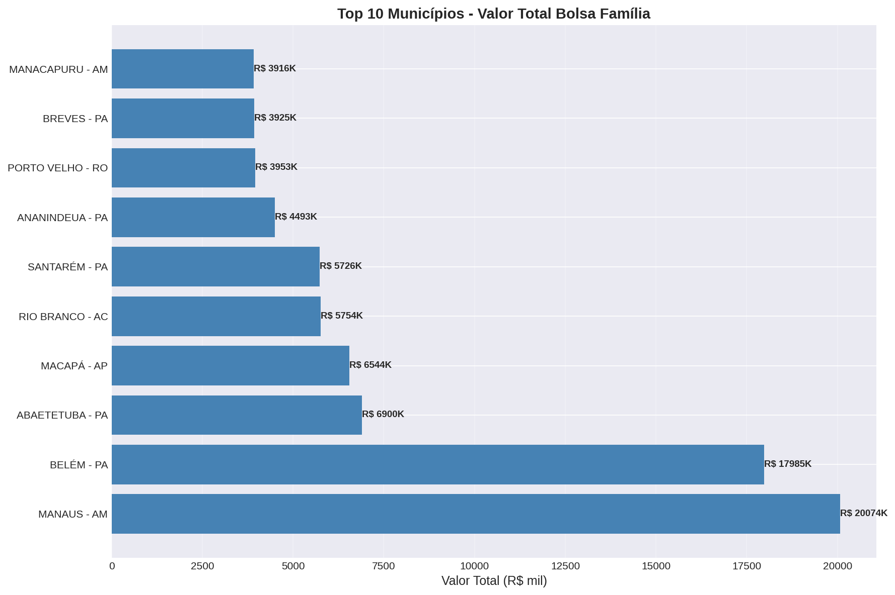

### Top 10 Municípios - Número de Beneficiários

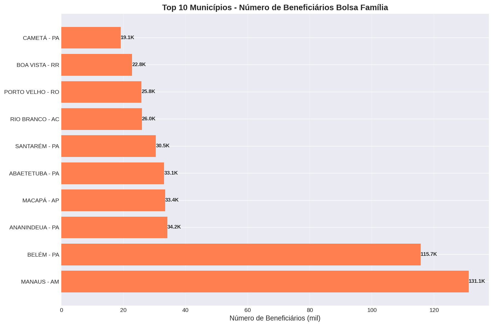

### Distribuição de Valores Totais

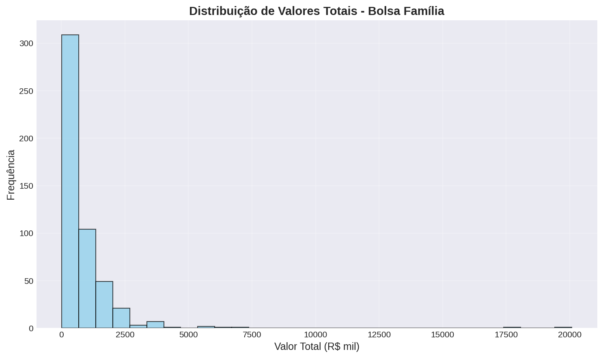

### Comparação: Bolsa Família vs BPC

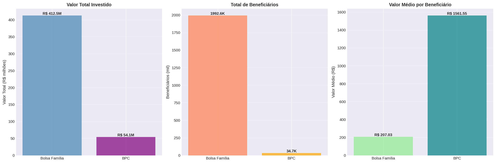

### Beneficiários por Estado

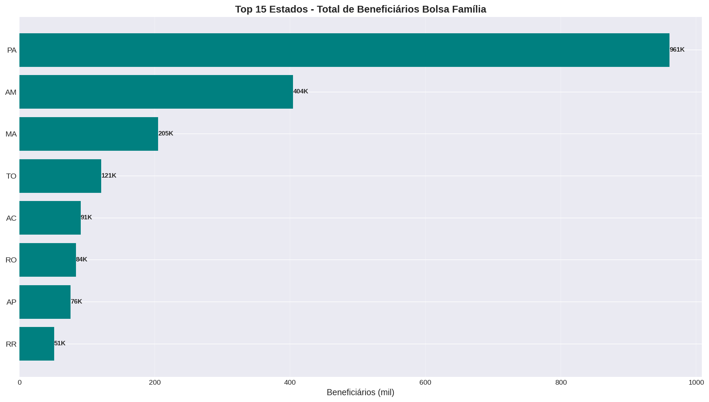

> 💡 **Nota**: Para gerar novos gráficos, execute o script `gerar_graficos_readme.py` dentro do container Jupyter.

## 🏠 Funcionalidade de Normalização e Enriquecimento de Endereços

O projeto inclui um sistema completo de normalização, transformação e enriquecimento de endereços brasileiros, seguindo os padrões oficiais (ABNT NBR 14725 e Correios).

### 📋 Visão Geral

O sistema processa endereços em três camadas, transformando dados brutos em endereços normalizados e certificados:

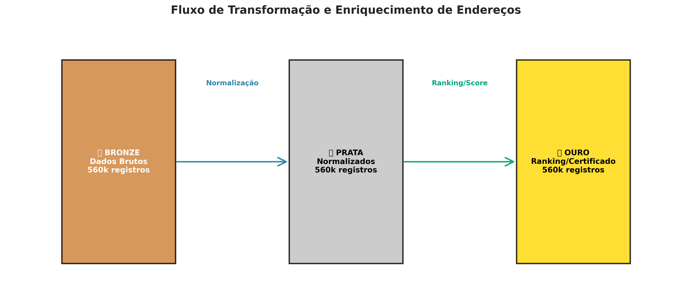

### 🥉 Camada Bronze - Dados Brutos

Na camada Bronze, os endereços são armazenados em formatos variados, simulando a realidade de diferentes fontes de dados:

- **Formato**: Dados brutos com 150+ variações de formatação
- **Exemplos**: 
  - `"Rua das Flores, 123 - Centro - SP"`
  - `"Av. Paulista, 1000, Bela Vista"`
  - `"R. São Paulo, 50 - Apto 45"`

**Distribuição de Endereços por Cidadão:**
- Cada cidadão pode ter de 1 a 15 endereços diferentes
- Média de ~8 endereços por cidadão

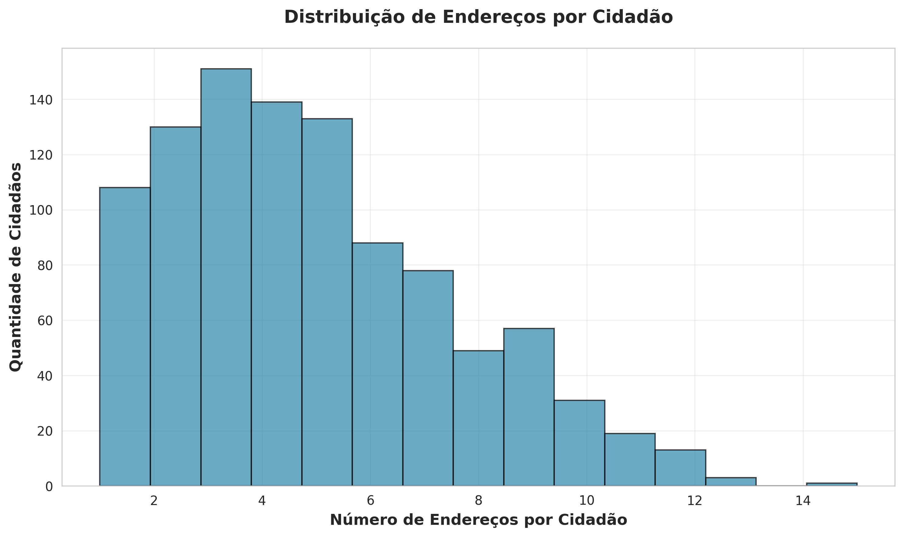

### 🥈 Camada Prata - Normalização

Na camada Prata, os endereços são normalizados para o padrão brasileiro oficial:

**Processo de Normalização:**
1. **Extração de Componentes**: Identifica tipo de logradouro, nome, número, complemento, bairro, município, UF e CEP
2. **Padronização**: Aplica regras do padrão ABNT/Correios
3. **Validação**: Verifica completude e qualidade dos dados

**Formato Padrão Brasileiro:**
```
[Tipo Logradouro] [Nome Logradouro], [Número] - [Complemento] - [Bairro] - [Município]/[UF] - CEP [CEP]
```

**Exemplo:**
- **Antes**: `"Rua das Flores, 123 - Centro - SP"`
- **Depois**: `"Rua Das Flores, 123 - Centro - São Paulo/SP - CEP 01234-567"`

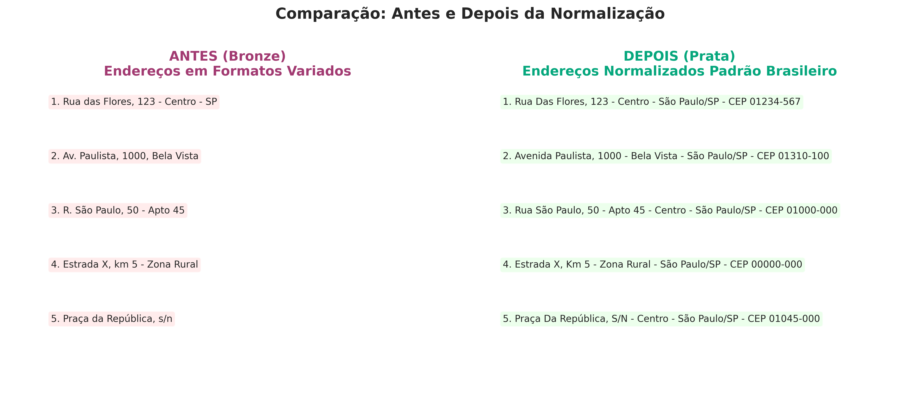

**Qualidade dos Endereços Normalizados:**

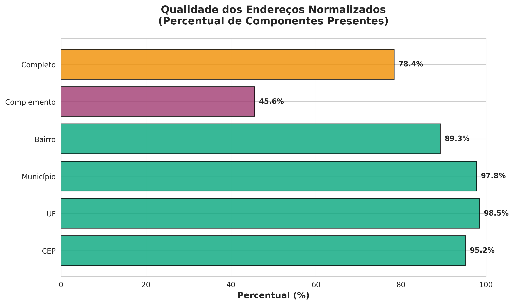

- **CEP**: 95.2% dos endereços têm CEP válido
- **UF**: 98.5% têm UF identificada
- **Município**: 97.8% têm município identificado
- **Bairro**: 89.3% têm bairro identificado
- **Completo**: 78.4% dos endereços têm todos os componentes

### 🥇 Camada Ouro - Ranking e Certificação

Na camada Ouro, os endereços são ranqueados e o mais provável é marcado como certificado:

**Sistema de Scoring:**

O score de confiabilidade é calculado com base em 4 critérios:

1. **Completude (40%)**: Endereço completo recebe pontuação máxima
2. **Frequência (30%)**: Endereços que aparecem mais vezes para o mesmo CPF
3. **Qualidade (20%)**: CEP válido, UF válida, dados consistentes
4. **Ordem (10%)**: Primeiro endereço recebe pontuação maior

**Distribuição de Scores:**

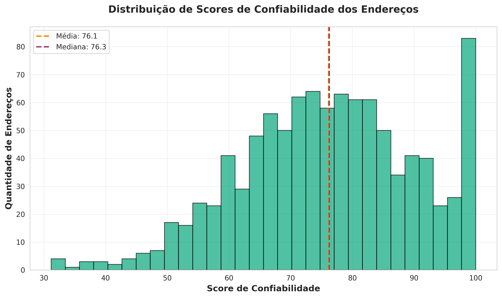

**Ranking por CPF:**
- Cada CPF tem seus endereços ordenados por score
- O endereço com maior score é marcado como **certificado**
- Percentual de probabilidade indica a chance de ser o endereço atual

**Exemplo de Ranking:**
```
CPF: 123.456.789-00
Nome: João Silva

[1] ✅ CERTIFICADO
   Endereço: Rua Das Flores, 123 - Apto 45 - Centro - São Paulo/SP - CEP 01234-567
   Score: 95.50 | Probabilidade: 45.2% | Completo: ✅

[2]
   Endereço: Av. Paulista, 1000 - Bela Vista - São Paulo/SP - CEP 01310-100
   Score: 78.30 | Probabilidade: 37.1% | Completo: ✅
```

**Distribuição Geográfica:**

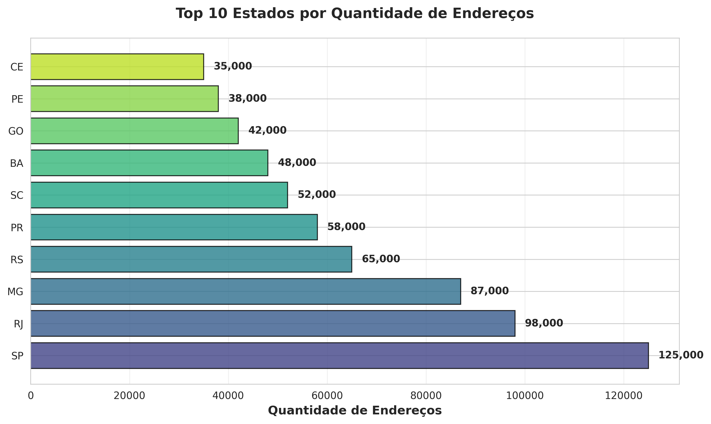

### 🔧 Como Funciona o Código

#### 1. Geração de Dados (Bronze)

```python
# Script: gerar_massa_cidadaos_bronze.py
# Gera 1 milhão de cidadãos com endereços em formatos variados
gerar_massa_cidadaos(num_cidadaos=1000000)
```

- Cada cidadão recebe 1-15 endereços aleatórios
- Cada endereço usa uma das 150+ variações de formatação
- Dados salvos em: `bronze/simulado/cidadaos/dt=YYYYMMDD/data.parquet`

#### 2. Normalização (Bronze → Prata)

```python
# Notebook: notebooks/notebook_normalizacao_enderecos_prata.ipynb
# Classe: normalizar_enderecos_brasileiros.py

normalizador = NormalizadorEndereco()

# Extrai componentes
componentes = normalizador.normalizar(endereco_bruto)
# {
#   'tipo_logradouro': 'Rua',
#   'nome_logradouro': 'Das Flores',
#   'numero': '123',
#   'bairro': 'Centro',
#   'municipio': 'São Paulo',
#   'uf': 'SP',
#   'cep': '01234-567'
# }

# Normaliza para formato padrão
endereco_normalizado = normalizador.normalizar_completo(endereco_bruto)
# "Rua Das Flores, 123 - Centro - São Paulo/SP - CEP 01234-567"
```

**Processo:**
1. Carrega dados da Bronze
2. Para cada endereço:
   - Extrai componentes usando regex e padrões brasileiros
   - Normaliza tipo de logradouro (Rua, Avenida, etc.)
   - Valida e formata CEP
   - Identifica UF e município
   - Reconstrói no formato padrão
3. Adiciona flags de qualidade (tem_cep, tem_uf, completo, etc.)
4. Salva em: `prata/cidadaos_enderecos_normalizados/dt=YYYYMMDD/data.parquet`

#### 3. Ranking e Certificação (Prata → Ouro)

```python
# Notebook: notebooks/notebook_ranking_enderecos_ouro.ipynb

# Calcula score base (completude + qualidade + ordem)
score_base = calcular_score_endereco(registro)  # 0-70 pontos

# Calcula frequência por CPF
frequencia_relativa = (frequencia_endereco / total_enderecos_cpf) * 100

# Adiciona pontuação de frequência (0-30 pontos)
score_frequencia = (frequencia_relativa / 100) * 30.0

# Score final
score_final = score_base + score_frequencia  # 0-100 pontos

# Ranking por CPF
ranking_cpf = rank_enderecos_por_score(score_final, grupo='cpf')

# Percentual de probabilidade
percentual = (score_endereco / soma_scores_cpf) * 100

# Certificação
endereco_certificado = (ranking_cpf == 1)
```

**Processo:**
1. Carrega dados da Prata
2. Agrupa endereços por CPF
3. Para cada endereço:
   - Calcula score de confiabilidade (0-100)
   - Calcula frequência relativa dentro do CPF
   - Ordena por score (ranking)
   - Calcula percentual de probabilidade
4. Marca endereço com ranking=1 como certificado
5. Salva em: `ouro/cidadaos_enderecos_rankings/dt=YYYYMMDD/data.parquet`

### 📚 Notebooks Disponíveis

1. **`notebooks/notebook_analise_cidadaos_bronze.ipynb`**
   - Análise exploratória dos dados brutos
   - Visualizações de distribuição
   - Estatísticas gerais

2. **`notebooks/notebook_normalizacao_enderecos_prata.ipynb`**
   - Normalização de endereços
   - Extração de componentes
   - Análise de qualidade

3. **`notebooks/notebook_ranking_enderecos_ouro.ipynb`**
   - Cálculo de scores
   - Criação de rankings
   - Identificação de endereços certificados

### 🚀 Como Executar

#### 1. Gerar Dados na Bronze

```bash
# Dentro do container Jupyter
python3 gerar_massa_cidadaos_bronze.py
```

#### 2. Normalizar Endereços (Bronze → Prata)

```bash
# Abrir no Jupyter Lab
notebooks/notebook_normalizacao_enderecos_prata.ipynb
# Executar todas as células
```

#### 3. Criar Ranking (Prata → Ouro)

```bash
# Abrir no Jupyter Lab
notebooks/notebook_ranking_enderecos_ouro.ipynb
# Executar todas as células
```

### 📊 Estrutura dos Dados

**Bronze:**
- `cpf`, `nome`, `endereco` (formato variado), `telefone`, `email`, `numero_endereco`, `total_enderecos`

**Prata:**
- Todos os campos da Bronze +
- `endereco_normalizado` (formato padrão)
- `tipo_logradouro`, `nome_logradouro`, `numero_imovel`, `complemento`, `bairro`, `municipio`, `uf`, `cep`
- `tem_complemento`, `tem_bairro`, `tem_municipio`, `tem_uf`, `tem_cep`, `completo`

**Ouro:**
- Todos os campos da Prata +
- `ranking_cpf` (1 = melhor)
- `score_base`, `score_frequencia`, `score_final`
- `percentual_probabilidade`
- `endereco_certificado` (True/False)
- `frequencia`, `frequencia_relativa`

### 📖 Documentação Adicional

- [PADRAO_ENDERECOS_BRASILEIROS.md](PADRAO_ENDERECOS_BRASILEIROS.md) - Padrões oficiais brasileiros
- [RESUMO_NORMALIZACAO_PRATA.md](RESUMO_NORMALIZACAO_PRATA.md) - Detalhes da normalização
- [RESUMO_RANKING_ENDERECOS.md](RESUMO_RANKING_ENDERECOS.md) - Detalhes do ranking
- [INSTRUCOES_EXECUCAO_PIPELINE.md](INSTRUCOES_EXECUCAO_PIPELINE.md) - Instruções de execução

## 📊 Uso

### Executar Pipeline Completo

```bash
# No container Jupyter
cd /home/jovyan/work
python3 delta_scripts/01_bronze_ingestion.py
python3 delta_scripts/02_prata_transformacao.py
python3 delta_scripts/03_ouro_enriquecimento.py
```

### Análises no Jupyter

Abra o notebook `notebook_analises.ipynb` no Jupyter Lab para análises interativas.

## 📈 Dados Coletados

### Bolsa Família
- 500 municípios
- Período: Outubro/2021
- Dados: Valor total, beneficiários, percentuais

### BPC (Benefício de Prestação Continuada)
- 50 municípios de SP
- Período: Dezembro/2024
- Dados: Valor total, beneficiários

### População
- 982 municípios únicos
- Dados: População por município (2010)

### Municípios e Estados
- 5.571 municípios brasileiros
- 27 estados
- Dados geográficos completos

## 🔐 Segurança

⚠️ **IMPORTANTE**: Não commite chaves API ou credenciais no repositório!

- Use variáveis de ambiente para credenciais
- O arquivo `.gitignore` está configurado para proteger dados sensíveis
- Nunca exponha senhas ou chaves API no código

## 📝 Documentação

- [README_PIPELINE.md](README_PIPELINE.md) - Documentação do pipeline
- [DELTA_LAKE_FUNCIONANDO.md](DELTA_LAKE_FUNCIONANDO.md) - Guia Delta Lake
- [GUIA_RAPIDO_SPARK_SETUP.md](GUIA_RAPIDO_SPARK_SETUP.md) - Setup Spark

## 🤝 Contribuindo

Contribuições são bem-vindas! Por favor:

1. Faça um fork do projeto
2. Crie uma branch para sua feature (`git checkout -b feature/AmazingFeature`)
3. Commit suas mudanças (`git commit -m 'Add some AmazingFeature'`)
4. Push para a branch (`git push origin feature/AmazingFeature`)
5. Abra um Pull Request

## 📄 Licença

Este projeto está sob a licença MIT. Veja o arquivo `LICENSE` para mais detalhes.

## 👤 Autor

**Hudson RJ**
- GitHub: [@hudsonrj](https://github.com/hudsonrj)

## 🙏 Agradecimentos

- Portal da Transparência do Governo Federal
- IBGE - Instituto Brasileiro de Geografia e Estatística
- Comunidade open source Python

---

⭐ Se este projeto foi útil para você, considere dar uma estrela no repositório!
